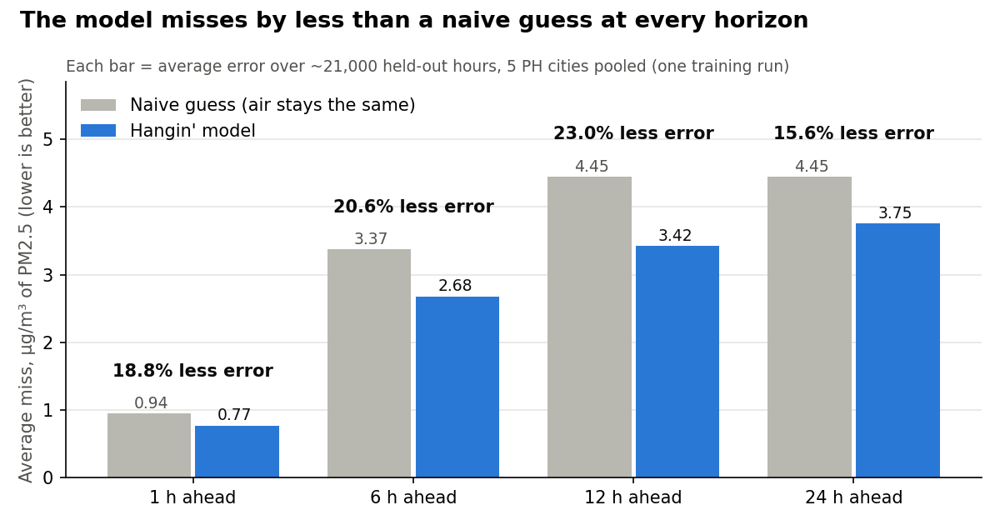

# Hangin' — Philippine Air-Quality Forecasting & Health-Risk Dashboard

> *hangin* (Tagalog: **wind, air**) — so… how's the air hangin'?

Forecasts PM2.5 for Philippine cities **1–24 hours ahead** and translates it into
plain-language health advice. Unlike existing PH air trackers, which only show the
current reading, Hangin' **predicts where air quality is heading** — and shows its own
model's accuracy honestly, backtested against a naive baseline.



**Live:** https://hangin-acra1.vercel.app — refreshed by a scheduled GitHub Action.

## Result
On ~21,000 held-out hours (the last 20% of the data, never seen in training), the model's
average error is **15.6–23.0% lower** than a naive "air stays the same" guess at every
horizon from 1 to 24 hours.

| Horizon | Model MAE (µg/m³) | R² | Naive persistence MAE | Lift |
|--------:|:-----------------:|:--:|:---------------------:|:----:|
| 1 h  | 0.77 | 0.96 | 0.94 | +18.8% |
| 6 h  | 2.68 | 0.74 | 3.37 | +20.6% |
| 12 h | 3.42 | 0.57 | 4.45 | +23.0% |
| 24 h | 3.76 | 0.45 | 4.45 | +15.6% |

One pooled model across Manila, Quezon City, Cebu, Davao and Baguio, trained on
~2.4 years of hourly data per city (mid-2022 to end-2024; Open-Meteo's archive starts
mid-2022). Split is chronological 60/20/20 (train / tune / test). Source of truth:
[`data/backtest.json`](data/backtest.json); the chart is rebuilt from it by
`python ml/make_figure.py`.

## Limitations
- **One training run, one seed.** There is no run-to-run spread yet, so small gaps
  between horizons may be noise.
- **R² falls to 0.45 at 24 h.** The model beats the naive guess there, but still misses
  a lot of the day-ahead swing.
- **Inputs are modelled, not sensor readings.** Open-Meteo's PM2.5 comes from the
  CAMS atmospheric model, so the model learns to forecast that — not a ground monitor.
- **Not medical advice.** The health tips follow the US EPA AQI bands.

## Data (all free, no API key)
- **Open-Meteo Air-Quality API** — PM2.5/PM10/NO₂/O₃/CO/SO₂, hourly history + forecast
- **Open-Meteo Archive (weather)** — temperature, humidity, wind, rain, pressure, PBL height

## Stack
- **ML:** Python · pandas · scikit-learn (`HistGradientBoostingRegressor`)
- **Web:** React + Vite (dashboard)
- **Refresh:** scheduled job re-fetches data and republishes forecasts

## Run the model
```bash
pip install -r requirements.txt
python ml/train.py        # fetches ~131k rows, trains 4 models, writes data/backtest.json
python ml/forecast.py     # live forecast -> web/public/forecasts.json
python ml/make_figure.py  # rebuilds docs/backtest.png
```
Training takes about 2–4 minutes on a laptop CPU (no GPU, no cost; the data is free).

## License
MIT — see [LICENSE](LICENSE).
